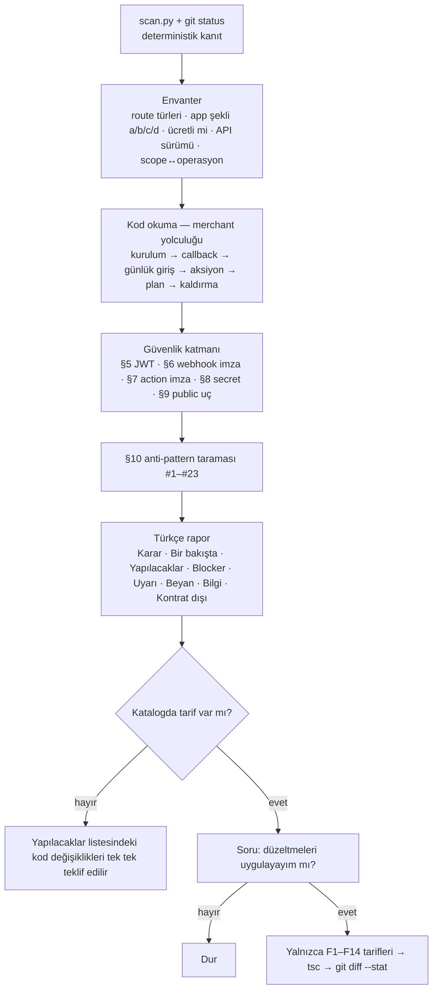

# ikas-app-skills

ikas app projeleri için Claude Code skill kütüphanesi. Skill'ler tek bir plugin (`ikas-app`) altında  
toplanır ve Claude Code plugin marketplace'i ile dağıtılır. Tema (Code Components) skill'leri  
için diğer repoya göz atın: `ikascom/ikas-cc-skills`.

## Kurulum

```
/plugin marketplace add ikascom/ikas-app-skills
/plugin install ikas-app@ikas-app-skills
```

Gereksinimler: Claude Code, `python3` (scanner ve şema aracı; ek paket yok), `git`
(untracked/ignored dosya işaretleri için; repo olmayan projeler de taranır).

Kurulumdan sonra Claude ilgili bir görevle karşılaştığında skill'i kendisi devreye alır;
`/ikas-app-preflight` ile elle de çağrılabilir. Güncelleme: `/plugin marketplace update ikas-app-skills`.

> Skill frontmatter'ı Claude Code'a özgü alanlar (`argument-hint`, `effort`) içerir. Plugin
> olarak kurulduğunda sorun yoktur; claude.ai'ye tekil skill yüklemesi veya Skills API
> paketlemesi bu alanları reddeder.

## Skill Kataloğu

| Skill | Ne zaman kullanılır |
|---|---|
| [ikas-app-preflight](#ikas-app-preflight) | Bir ikas Admin App'i App Store review'ına göndermeden önce ön koşulları, OAuth/App Bridge sözleşmesini ve güvenlik katmanını denetlemek; rapor sonrası onayla katalogdaki düzeltmeleri uygulamak |

---

### ikas-app-preflight

Bir ikas Admin App'in **App Store review'ı öncesi ön kontrolü.** Reviewer'ın ve merchant'ın
göreceği şeyi koddan tahmin eder, reviewer'ın ulaşamayacağı güvenlik açıklarını bulur.

**Ne yapar / ne yapmaz.** Kod ve yapı sözleşmesini denetler: OAuth başlatma ve callback,
iframe/App Bridge, webhook ve aksiyon imzaları, JWT'li backend, secret hijyeni, public uçlar,
scope↔operasyon eşlemesi, Admin API v1/v2 sürüm↔operasyon adı uyumu. **Çalışma zamanını test
etmez**: uygulamanın token'ıyla ikas'a istek atmaz, yetki reddi veya platform davranışı
gibi yalnız canlıda görünen hataları yakalayamaz. Raporda hiçbir zaman "review'dan geçer"
demez; "bu kural setine göre Blocker kalmadı" der.

#### Kural seti ve kaynakları

Ölçüt, skill ile gelen `references/app-review.md` (§0–§12). Her kural kaynağını taşır:

| Etiket | Kaynak |
|---|---|
| `[docs:…]` | builders.ikas.com sayfaları (build-publish, auth-steps, callback-api, scope-changes, app-actions, plans, webhooks, admin-app, development, hosting) |
| `[sdk]` | `@ikas/admin-api-client` 2.0.11 **ve** 2.1.0, `@ikas/app-helpers` 1.0.10 — tip tanımları ve `dist` implementasyonu okunarak |
| `[starter]` | Resmi `ikascom/ikas-app-examples` davranışı (gereklilik değil, kalibrasyon referansı) |
| `[partner-panel]` | Partner panel ekranları (Konfigürasyon, Aksiyonlar, Yayınlama, Planlar, İzin Verilen Mağazalar) |
| `[schema]` | Canlı Admin API introspection'ı (`scripts/schema.py`, token gerekmez). **v1 ve v2 farklı şemalardır**; resmi örnekler v2 kullanır, `schema.py --v1` v1'e bakar |
| `[mcp]` | ikas admin MCP (124 operasyonun 59'u; imza render hatası olabilir, `[schema]` üstündür) |
| `[security]` | Standart web güvenliği akıl yürütmesi; ikas kuralı değil |
| `[observed]` | Gerçek review ret mesajları (§12 › R1–R7), canlı dev-store deneyleri (§12 › E1–E6) ve geliştirici destek kayıtları (§12 › S1) |

Her bulgu ya ihlal ettiği bölümü zikreder (§2.2, §6.1, §10 #4…) ya da "kontrat dışı"
etiketlenir. Docs ile şema/deney çeliştiğinde hangisinin kazandığı kuralda yazılıdır.

**Doğrulama disiplini.** Kural seti 2026-09-13'te üç resmi kaynağa (builders.ikas.com,
Postman koleksiyonu, canlı GraphQL şeması) ve npm'deki SDK paketlerine karşı satır satır
kontrol edilmiş; platform davranışına dair her iddia (kaldırmada token'ın iptal edilmemesi,
Admin kurulumunun doğrudan callback'e düşmesi, panel scope listesinin `scope` parametresini
ezmesi, `saveWebhooks`'un hangi scope'ları reddettiği…) bir dev mağazada en az iki kez
tekrar edilmiştir. Tek gözlemli veya tekrar edilemeyen iddialar (S1) kural değil, teşhis
notu olarak işaretlidir.

**Kalibrasyon kuralı.** Resmi örnek uygulamalar bu kural setinden **sıfır review-Blocker** ile
çıkar (`scripts/calibrate.sh`, CI'da her push'ta). Resmi starter'ın yaptığı bir şey (Math.random
state, `'api'` storeName fallback'i, koşulsuz Admin redirect'i, uninstall webhook'unun
olmaması…) en fazla Uyarı'dır; istisna yalnız sömürülebilir bir açıktır.

#### Bulgu sınıflandırması

| Sınıf | Anlamı |
|---|---|
| Blocker | Gönderimden önce düzeltilmeli. Nedeni her zaman yazılır: **review** (dokümante ön koşul), **güvenlik** (kimliksiz taraf zarar verebilir), **işlevsel** (reviewer panelde bozuk uygulama görür) |
| Uyarı | Docs'un istemediği sertleştirme/sağlamlık; tek başına ret sebebi değil |
| Beyan gerekli | Koddan görülemeyen ön koşul (partner doğrulama, 2 dev mağaza, reviewer test hesabı, Partner panel webhook/aksiyon/adres kayıtları) — sorulur, asla "geçti" sayılmaz |
| Bilgi / Kontrat dışı | Bağlam ve zorunlu olmayan öneriler (maks 5) |

#### Nasıl çalışır



Severity kaynağa göre belirlenir: docs'ta zorunlu/ön koşul → Blocker (review); kimliksiz taraf
zarar verebilir → Blocker (güvenlik); panelde/vitrinde görünür kırık → Blocker (işlevsel);
sertleştirme ve resmi starter da böyle yapıyor → Uyarı; koddan görülemez → Beyan gerekli;
hiçbir kural istemiyor → Kontrat dışı.

**Tetikleyiciler:** "uygulama review'a hazır mı", "app store'a göndermeden önce kontrol et",
"ikas app denetle", "webhook imzası doğru mu", "oauth akışı güvenli mi", "publish checklist".

**Argümanlar:** argümansız tam denetim; `quick` — scanner + anti-pattern; `section
<oauth|iframe|webhooks|actions|secrets|public>`; son argüman proje yolu olabilir.

Adım 1–5 hiçbir dosyayı değiştirmez. Adım 6'da onay alınmadan hiçbir düzenleme yapılmaz;
onay sonrası yalnızca `references/fix-catalogue.md` tarifleri (F1–F14) uygulanır, type-check
koşulur, `git diff --stat` raporlanır, commit atılmaz.

#### İçerik

```
plugins/ikas-app/skills/ikas-app-preflight/
├── SKILL.md                        # prosedür, argümanlar, onay akışı (İngilizce)
├── references/app-review.md        # kaynak etiketli kural seti §0–§12 (R1–R7 retler, E1–E6 deneyler, S1)
├── references/report-template.md   # Türkçe rapor şablonu + örnek
├── references/fix-catalogue.md     # onay sonrası uygulanabilir tarifler F1–F14
├── scripts/scan.py                 # kanıt tarayıcısı (--json, --section; import'ları takip eder; App + Pages Router)
├── scripts/schema.py               # canlı Admin API şeması: `schema.py deleteWebhook`, `schema.py --v1 saveWebhook`
├── scripts/calibrate.sh            # resmi örneklerde sıfır Blocker kapısı
└── tests/                          # fixture'lar + snapshot testi (tests/run.sh)
```

**Testler:** `tests/run.sh` — `tests/fixtures/broken-app` (starter + katalogdaki her kusur +
v1/v2 ve scope karışıklıkları) ve `tests/fixtures/external-dashboard` (R1–R4 ret senaryoları)
için scanner çıktısı snapshot ile karşılaştırılır; `IKAS_APP_EXAMPLES=<klon> tests/run.sh`
ayrıca üç resmi örnekte `BLOCKER: 0` kapısını koşar. GitHub Actions her push'ta ikisini de
çalıştırır. Kural seti, scanner veya bir tarif değişince ikisi de koşturulur.

> `scan.py` yalnızca kanıt toplar — bir bulgu "okunacak yer", bulgu yokluğu "kanıtlanmış"
> değildir. Nihai karar SKILL.md'deki adımlarda kod okunarak verilir.

## Katkı

- **Yeni bir ret sebebi:** mesajı `app-review.md` §12 › Rejections tablosuna R-numarasıyla ekle,
  ilgili § kuralını `[observed] R<n>` ile güncelle, gerekiyorsa fixture'a kusuru ekle,
  `tests/run.sh --update` ile snapshot'ı yenile.
- **Platform davranışına dair yeni iddia:** bir dev mağazada tekrar et, §12 › Experiments'a
  E-numarasıyla yaz (ne yapıldı / ne görüldü / hangi kural), sonra kuralı güncelle. Tek
  gözlem kural olmaz.
- **Geliştirici destek kaydı:** §12 › Support tickets'a S-numarasıyla ekle; tekrar edilene
  kadar "teşhis notu" olarak kalır.
- **Şema değişikliği:** `scan.py` içindeki `V1_ONLY_OPS` / `V2_ONLY_OPS` listeleri ve
  `app-review.md` §11 tarihlidir; `schema.py` (ve `--v1`) ile yenile.
- Skill metni İngilizce, rapor ve README Türkçe.

## Lisans

[MIT](LICENSE) © İKAS TEKNOLOJİ A.Ş.
