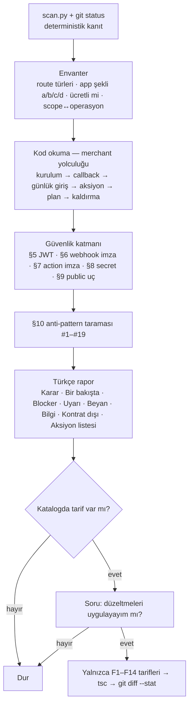
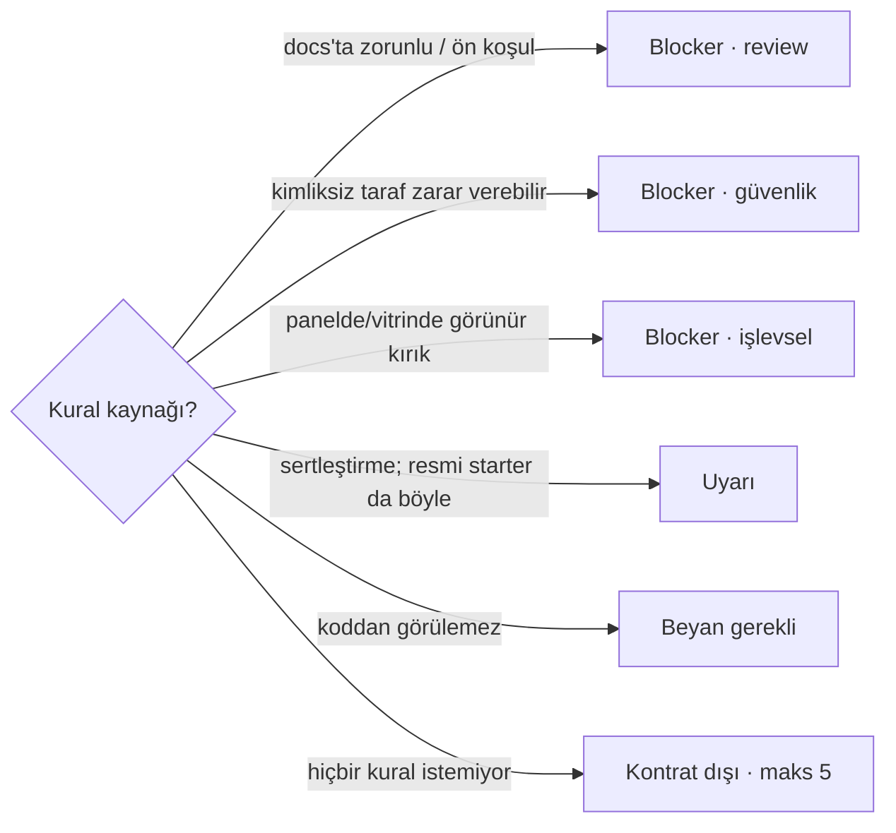

# ikas-app-skills

ikas Admin App (Next.js ile geliştirilip OAuth ile mağaza paneline kurulan uygulama)
projelerinde kullanılmak üzere hazırlanmış Claude Code skill kütüphanesi. Skill'ler tek bir
plugin (`ikas-app`) altında toplanır ve Claude Code'un plugin marketplace özelliğiyle
dağıtılır. Tema (Code Components) skill'leri için kardeş repo: `ikascom/ikas-cc-skills`.

## Kurulum

```
/plugin marketplace add ikascom/ikas-app-skills
/plugin install ikas-app@ikas-app-skills
```

Kurulumdan sonra Claude ilgili bir görevle karşılaştığında skill'i kendisi devreye alır;
`/ikas-app-preflight` ile elle de çağrılabilir.

Güncelleme: `/plugin marketplace update ikas-app-skills`

## Skill Kataloğu

| Skill | Ne zaman kullanılır |
|---|---|
| [ikas-app-preflight](#ikas-app-preflight) | Bir ikas Admin App'i App Store review'ına göndermeden önce ön koşulları ve güvenlik katmanını denetlemek; rapor sonrası onayla katalogdaki düzeltmeleri uygulamak |

---

### ikas-app-preflight

Bir ikas Admin App'in **App Store review'ı öncesi ön kontrolü.** Ölçüt, skill ile gelen
`references/app-review.md` kural seti. Her kural kaynağını taşır — `[docs:…]` (builders.ikas.com
sayfası), `[sdk]` (`@ikas/admin-api-client`, `@ikas/app-helpers`), `[starter]` (resmi
`ikascom/ikas-app-examples` davranışı), `[partner-panel]` (Partner panel ekranları), `[schema]` (canlı Admin API şeması, `scripts/schema.py`), `[mcp]` (ikas MCP; 124 operasyonun 59'u, imza render hatası olabilir), `[security]`,
`[observed]` (gerçek review ret mesajları, §12 R1–R7) — ve her bulgu ya ihlal
ettiği bölümü zikreder (§2.2, §6.1, §10 #4…) ya da "kontrat dışı" etiketlenir.

**Kalibrasyon kuralı:** resmi örnek uygulamalar bu kural setinden **sıfır review-Blocker** ile
çıkar. Resmi starter'ın yaptığı bir şey (Math.random state, `'api'` storeName fallback'i,
koşulsuz Admin redirect'i, uninstall webhook'unun olmaması…) en fazla Uyarı'dır.

**Tetikleyiciler:** "uygulama review'a hazır mı", "app store'a göndermeden önce kontrol et",
"ikas app denetle", "webhook imzası doğru mu", "oauth akışı güvenli mi", "publish checklist".

**Bulgu sınıflandırması:**

| Sınıf | Anlamı |
|---|---|
| Blocker | Gönderimden önce düzeltilmeli. Nedeni her zaman yazılır: **review** (dokümante ön koşul), **güvenlik** (kimliksiz taraf zarar verebilir), **işlevsel** (reviewer panelde bozuk uygulama görür) |
| Uyarı | Docs'un istemediği sertleştirme/sağlamlık; tek başına ret sebebi değil |
| Beyan gerekli | Koddan görülemeyen ön koşul (partner doğrulama, 2 dev mağaza, reviewer test hesabı, Partner panel webhook kaydı) — sorulur, asla "geçti" sayılmaz |
| Bilgi / Kontrat dışı | Bağlam ve zorunlu olmayan öneriler (maks 5) |

**Nasıl çalışır:**



**Severity nasıl belirlenir:**



**Akış (adım adım):** (1) `scripts/scan.py` ile deterministik kanıt + `git status` (untracked/ignored dosyalar
da denetlenir, raporda işaretlenir); (2) route envanteri ve **app şekli** — panel içi dashboard /
harici dashboard / yalnızca action / headless; (3) merchant yolculuğu ve güvenlik katmanı, kod
okunarak; (4) §10 anti-pattern taraması; (5) Türkçe rapor; (6) **onay sorusu** — "katalogdaki
düzeltmeleri uygulayayım mı?" → evet ise yalnızca `references/fix-catalogue.md` tarifleri
uygulanır, type-check koşulur, `git diff --stat` raporlanır. Onay verilmeden hiçbir dosya değişmez.

**Argümanlar:** argümansız tam denetim; `quick` — scanner + anti-pattern; `section
<oauth|iframe|webhooks|actions|secrets|public>`; son argüman proje yolu olabilir.

**İçerik:**

```
skills/ikas-app-preflight/
├── SKILL.md                        # prosedür, argümanlar, onay akışı (İngilizce)
├── references/app-review.md        # kaynak etiketli kural seti §0–§12 (+ gerçek ret listesi R1–R7)
├── references/report-template.md   # Türkçe rapor şablonu + örnek
├── references/fix-catalogue.md     # onay sonrası uygulanabilir tarifler F1–F14
├── scripts/scan.py                 # kanıt tarayıcısı (--json, --section; import'ları takip eder; App + Pages Router)
├── scripts/schema.py               # canlı Admin API şeması: `schema.py deleteWebhook` (token gerekmez; `[schema]` kaynağı)
├── scripts/calibrate.sh            # resmi örneklerde sıfır Blocker kapısı
└── tests/                          # fixture'lar + snapshot testi (tests/run.sh)
```

**Testler:** `tests/run.sh` — `tests/fixtures/broken-app` (starter + katalogdaki her kusur) ve
`tests/fixtures/external-dashboard` (R1–R4 ret senaryoları) için scanner çıktısı snapshot ile
karşılaştırılır; `IKAS_APP_EXAMPLES=<klon> tests/run.sh` ayrıca üç resmi örnekte `BLOCKER: 0`
kapısını koşar. Kural seti, scanner veya bir tarif değişince ikisi de koşturulur.

**Yeni bir ret sebebi geldiğinde:** mesajı `app-review.md` §12 › Rejections tablosuna R-numarasıyla
ekle, ilgili § kuralını `[observed] R<n>` ile güncelle, gerekiyorsa fixture'a kusuru ekle ve
`tests/run.sh --update` ile snapshot'ı yenile.

> `scan.py` yalnızca kanıt toplar — bir bulgu "okunacak yer", bulgu yokluğu "kanıtlanmış"
> değildir. Nihai karar SKILL.md'deki adımlarda kod okunarak verilir.

## Lisans

[MIT](LICENSE) © İKAS TEKNOLOJİ A.Ş.
